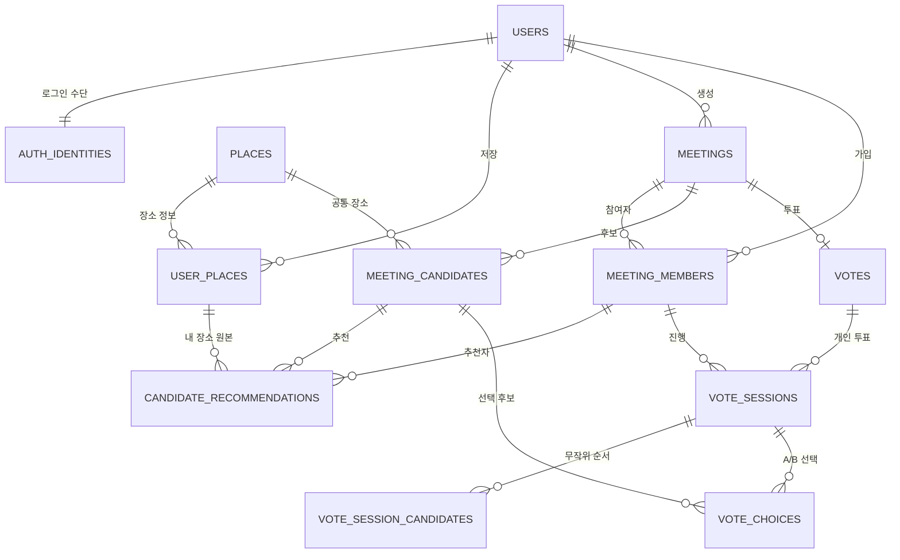

# DAMO 데이터 모델

## 1. 문서 목적

이 문서는 DAMO MVP에서 저장해야 하는 데이터와 데이터 간 관계, 상태, 중복 및 삭제 규칙을 정의한다.

- 화면 흐름은 `flow.md`를 기준으로 한다.
- 데이터베이스 제품이 아직 정해지지 않았으므로 자료형은 PostgreSQL 기준의 일반적인 표기로 작성한다.
- 모든 날짜와 시각은 서버에서 표준 시각으로 저장하고, 화면에는 `Asia/Seoul` 기준으로 표시한다.
- 비밀번호 원문, OAuth 접근 토큰과 같은 인증 비밀값은 일반 서비스 데이터에 저장하지 않는다.

## 2. 핵심 설계 원칙

### 2.1 계정과 인증을 분리한다

사용자 프로필과 로그인 수단을 분리한다.

- `users`: DAMO에서 사용하는 닉네임과 이메일
- `auth_identities`: 테스트 로그인 또는 OAuth 로그인 정보
- 테스트 단계에서는 아이디·닉네임·비밀번호로 즉시 가입할 수 있다.
- 배포 시 테스트 로그인을 제거해도 사용자, 모임, 장소 데이터 구조에는 영향을 주지 않는다.
- 카카오·네이버·구글 계정은 이메일이 같더라도 자동으로 합치지 않는다.

### 2.2 네이버 장소와 내 장소를 분리한다

같은 네이버 장소를 여러 사용자가 저장할 수 있으므로 장소 자체와 사용자의 저장 정보를 분리한다.

- `places`: 네이버 장소 ID를 기준으로 한 공통 장소 정보
- `user_places`: 사용자가 저장한 목적과 성격

### 2.3 후보 장소와 추천자를 분리한다

같은 장소를 여러 모임원이 추천해도 모임 후보는 하나만 생성한다.

- `meeting_candidates`: 모임에 표시되는 중복 제거 후보
- `candidate_recommendations`: 후보를 추천한 모임원

따라서 후보에 표시하는 `추천한 사람 N명`은 추천 기록의 수로 계산할 수 있다.

### 2.4 투표 생성 시 후보를 고정한다

투표 생성 전에는 후보를 자유롭게 선택·취소·변경할 수 있다. 투표가 생성되면 당시 후보와 추천 정보를 고정한다.

- 투표 생성 전: `내 장소` 변경을 이번 투표 후보에 반영할 수 있다.
- 투표 생성 후: `내 장소`를 변경하거나 등록 해제해도 생성된 투표에는 영향을 주지 않는다.
- 과거 결과가 바뀌지 않도록 투표 생성 시 후보의 장소명, 주소, 목적, 성격을 스냅샷으로 보관한다.

### 2.5 삭제는 기본적으로 기록을 남긴다

모임과 내 장소는 즉시 물리적으로 삭제하지 않고 `deleted_at`을 기록하는 소프트 삭제를 사용한다.

- 사용자의 일반 화면에서는 삭제 즉시 숨긴다.
- 잘못된 삭제, 투표 집계 확인, 운영상 문제 조사에 필요한 최소 기록을 보존한다.
- 실제 영구 삭제 주기는 개인정보 정책을 확정한 뒤 별도로 정한다.

## 3. 데이터 관계



## 4. 공통 규칙

### 4.1 기본 키

- 내부 데이터 식별자는 예측하기 어려운 UUID를 사용한다.
- 네이버 장소 ID, OAuth 제공자 사용자 ID 등 외부 식별자를 내부 기본 키로 직접 사용하지 않는다.

### 4.2 공통 시각 필드

주요 테이블에는 필요에 따라 다음 필드를 둔다.

| 필드 | 의미 |
| --- | --- |
| `created_at` | 생성 시각 |
| `updated_at` | 마지막 변경 시각 |
| `deleted_at` | 소프트 삭제 시각. 삭제되지 않았다면 `NULL` |

### 4.3 목적과 성격

모임과 내 장소에서 같은 코드값을 사용한다.

| 구분 | 코드 | 화면 표시 |
| --- | --- | --- |
| 목적 | `STUDY` | 스터디 |
| 목적 | `CAFE` | 카페 |
| 목적 | `MEAL` | 식사 |
| 목적 | `DRINK` | 술 한잔 |
| 성격 | `FUN` | 즐거운 |
| 성격 | `QUIET` | 조용한 |
| 성격 | `BUSINESS` | 비즈니스 |
| 성격 | `TIPSY` | 알딸딸 |

## 5. 사용자와 인증

### 5.1 `users`

DAMO 사용자 프로필을 저장한다.

| 필드 | 자료형 | 필수 | 설명 |
| --- | --- | --- | --- |
| `id` | UUID | O | 사용자 ID |
| `nickname` | VARCHAR(20) | O | 계정 기본 닉네임. 최대 20글자 |
| `email` | VARCHAR(255) | 조건부 | OAuth에서 제공받은 이메일 |
| `created_at` | TIMESTAMPTZ | O | 가입 시각 |
| `updated_at` | TIMESTAMPTZ | O | 프로필 변경 시각 |
| `deleted_at` | TIMESTAMPTZ | X | 계정 삭제 시각 |

규칙:

- 계정 닉네임은 모임별 닉네임의 기본값이다.
- 모임별 닉네임은 `meeting_members.meeting_nickname`에 별도로 저장한다.
- OAuth 제공자가 이메일을 제공하지 않는 상황을 고려해 이메일은 nullable로 둔다.
- 프로필 사진은 MVP에서 저장하지 않는다.

### 5.2 `auth_identities`

사용자의 로그인 수단을 저장한다.

| 필드 | 자료형 | 필수 | 설명 |
| --- | --- | --- | --- |
| `id` | UUID | O | 인증 정보 ID |
| `user_id` | UUID | O | 사용자 ID |
| `provider` | ENUM | O | `TEST`, `KAKAO`, `NAVER`, `GOOGLE` |
| `provider_user_id` | VARCHAR(255) | O | 제공자 내부 사용자 ID 또는 테스트 로그인 아이디 |
| `password_hash` | VARCHAR(255) | 조건부 | `TEST` 로그인에서만 사용 |
| `created_at` | TIMESTAMPTZ | O | 인증 정보 생성 시각 |
| `last_login_at` | TIMESTAMPTZ | X | 마지막 로그인 시각 |

고유성 규칙:

```text
UNIQUE(provider, provider_user_id)
UNIQUE(user_id)
```

- MVP에서는 하나의 사용자가 하나의 로그인 수단만 가진다.
- 같은 이메일로 다른 OAuth 제공자에 로그인해도 별개의 `users` 행을 생성한다.
- 테스트 로그인 비밀번호는 단방향 해시로만 저장한다.
- 배포 시에는 `provider = TEST` 가입과 로그인을 비활성화한다.

## 6. 장소

### 6.1 `places`

네이버 지도에서 가져온 공통 장소 정보를 저장한다.

| 필드 | 자료형 | 필수 | 설명 |
| --- | --- | --- | --- |
| `id` | UUID | O | 내부 장소 ID |
| `naver_place_id` | VARCHAR(100) | O | 네이버 장소 ID |
| `name` | VARCHAR(200) | O | 장소명 |
| `category` | VARCHAR(200) | X | 네이버 장소 카테고리 |
| `road_address` | VARCHAR(300) | X | 도로명 주소 |
| `jibun_address` | VARCHAR(300) | X | 지번 주소 |
| `latitude` | DECIMAL | O | 위도 |
| `longitude` | DECIMAL | O | 경도 |
| `naver_place_url` | VARCHAR(500) | X | 네이버 장소 상세 링크 |
| `last_synced_at` | TIMESTAMPTZ | O | 네이버 정보 확인 시각 |
| `created_at` | TIMESTAMPTZ | O | 최초 저장 시각 |
| `updated_at` | TIMESTAMPTZ | O | 마지막 정보 갱신 시각 |

고유성 규칙:

```text
UNIQUE(naver_place_id)
```

### 6.2 `user_places`

사용자가 `내 장소`에 저장한 장소와 분류를 저장한다.

| 필드 | 자료형 | 필수 | 설명 |
| --- | --- | --- | --- |
| `id` | UUID | O | 내 장소 ID |
| `user_id` | UUID | O | 저장한 사용자 |
| `place_id` | UUID | O | 공통 장소 |
| `purpose` | ENUM | O | 장소 목적 |
| `mood` | ENUM | O | 장소 성격 |
| `created_at` | TIMESTAMPTZ | O | 저장 시각 |
| `updated_at` | TIMESTAMPTZ | O | 분류 변경 시각 |
| `deleted_at` | TIMESTAMPTZ | X | 등록 해제 시각 |

고유성 규칙:

```text
사용자별 활성 상태의 동일 place_id는 하나만 허용
```

화면 처리:

- 저장되지 않은 장소 선택: `내 장소 등록하기`
- 이미 저장된 장소 선택: `장소 등록 해제`
- 등록 해제 시 투표 생성 전 후보 추천도 함께 취소할지 사용자에게 묻는다.
- 사용자가 이번 투표 반영을 선택하면 `RECRUITING` 상태 모임의 해당 추천을 제거한다.
- 다른 추천자가 남아 있으면 통합 후보는 유지하고 추천 인원 수만 줄인다.
- 추천자가 남아 있지 않으면 통합 후보도 제거한다.
- 이번 투표에 반영하지 않거나 투표가 이미 생성됐다면 후보 스냅샷은 유지한다.
- 등록 해제 후 같은 장소를 다시 저장하면 기존 행을 복구하거나 새 행을 생성할 수 있다. API에서는 한 가지 방식으로 통일한다.

### 6.3 내 장소 변경과 후보 반영

목적이나 성격을 변경할 때 다음 확인창을 표시한다.

```text
진행 중인 이번 투표에도 변경사항을 반영할까요?

[내 장소만 변경] [이번 투표에도 반영]
```

처리 규칙:

- `내 장소만 변경`: `user_places`만 변경한다.
- `이번 투표에도 반영`: 아직 투표가 생성되지 않은 모임의 추천 스냅샷도 변경한다.
- 반영 대상은 사용자가 활성 참여 중이고, `RECRUITING` 상태이며, 해당 `user_place_id`로 후보를 추천한 모임만 조회한다.
- 조건을 만족하는 모임이 여러 개면 사용자가 복수선택한 모임 ID만 변경한다.
- 변경 후 모임 목적과 성격이 모두 일치하지 않아도 해당 사용자의 추천은 유지한다.
- 불일치한 장소는 후보 선택 화면에서 낮은 투명도와 `조건 불일치` 상태로 표시한다.
- 투표가 생성된 모임은 후보가 고정되므로 선택지와 관계없이 반영하지 않는다.
- 사용자가 여러 모임에 같은 장소를 후보로 제출했다면 반영할 모임을 화면에서 명확히 표시한다.

## 7. 모임

### 7.1 모임 상태

| 상태 | 의미 |
| --- | --- |
| `RECRUITING` | 모임 가입 및 후보 선택 가능 |
| `VOTING` | 투표 생성 완료, A/B 투표 진행 중 |
| `FINAL_SELECTION` | 공동 1위 중 모임장 선택 대기 |
| `COMPLETED` | 최종 장소 확정 |
| `DELETED` | 모임장에 의해 삭제됨 |

상태 흐름:

```text
RECRUITING
  → VOTING
      ├─ 단독 1위 → COMPLETED
      └─ 공동 1위 → FINAL_SELECTION → COMPLETED

모든 상태 → DELETED
```

### 7.2 `meetings`

| 필드 | 자료형 | 필수 | 설명 |
| --- | --- | --- | --- |
| `id` | UUID | O | 모임 ID |
| `host_user_id` | UUID | O | 모임장 사용자 ID |
| `name` | VARCHAR(20) | O | 모임 이름. 최대 20글자 |
| `capacity` | INTEGER | O | 정원 |
| `purpose` | ENUM | O | 모임 목적 |
| `mood` | ENUM | O | 모임 성격 |
| `starts_at` | TIMESTAMPTZ | O | 만나는 날짜와 시각 |
| `timezone` | VARCHAR(50) | O | 기본값 `Asia/Seoul` |
| `join_code` | CHAR(4) | O | 4자리 숫자 가입 코드 |
| `status` | ENUM | O | 모임 상태 |
| `final_candidate_id` | UUID | X | 최종 확정 후보 |
| `series_id` | UUID | X | 정기 모임 묶음의 최초 모임 ID |
| `parent_meeting_id` | UUID | X | 바로 이전 회차의 모임 ID |
| `recurrence_type` | ENUM | X | `WEEKLY`, `MONTHLY`, `CUSTOM` |
| `recurrence_next_at` | TIMESTAMPTZ | X | 직접 입력한 다음 회차 일시 |
| `next_meeting_id` | UUID | X | 이미 생성된 다음 회차 ID |
| `voting_started_at` | TIMESTAMPTZ | X | 투표 생성 시각 |
| `voting_closed_at` | TIMESTAMPTZ | X | 모임장이 투표를 종료한 시각 |
| `completed_at` | TIMESTAMPTZ | X | 최종 장소 확정 시각 |
| `created_at` | TIMESTAMPTZ | O | 모임 생성 시각 |
| `updated_at` | TIMESTAMPTZ | O | 마지막 변경 시각 |
| `deleted_at` | TIMESTAMPTZ | X | 모임 삭제 시각 |

시간 입력 규칙:

- 사용자는 날짜, 오전/오후, 시, 분을 선택한다.
- 시는 `1~12`, 분은 `00` 또는 `30`만 선택한다.
- 서버로 전송하기 전에 하나의 날짜·시각으로 변환한다.
- 화면에서 오전 12시는 자정, 오후 12시는 정오로 안내한다.

정원 입력 규칙:

- 최소 정원은 2명이다.
- 서비스 정책상 최대 정원은 제한하지 않는다.
- `-`, `+` 버튼과 숫자 직접 입력을 모두 지원한다.
- API와 데이터베이스는 `capacity >= 2`를 검사한다.

가입 코드 규칙:

- `RECRUITING`, `VOTING`, `FINAL_SELECTION` 상태의 모임끼리는 가입 코드가 중복되지 않는다.
- 코드 발급은 데이터베이스의 고유성 검사를 포함한 트랜잭션으로 처리한다.
- `COMPLETED`, `DELETED` 상태의 모임 코드는 새로운 모임에서 다시 사용할 수 있다.
- 가입 코드만으로 모임을 찾을 때 삭제되거나 완료된 모임은 검색 대상에서 제외한다.

### 7.3 다시 만나기와 정기 모임

- 완료된 모임은 수정하거나 초기화하지 않고 새로운 회차를 생성한다.
- 날짜가 지났지만 서버 상태가 아직 완료되지 않은 모임도 `다시 만나기` 대상으로 본다.
- 새 회차는 모임명, 정원, 목적, 성격과 가입 코드를 이전 회차에서 가져오되 모임장이 수정할 수 있다.
- 새 회차 날짜는 요청 시점에서 7일 뒤를 기본값으로 하고, 분은 `00~59` 중 선택한다.
- 모임장은 이전 회차의 활성 모임원 중 자동 참여시킬 사람을 선택한다. 모임장은 항상 포함한다.
- 새 회차의 후보, 투표, 결과는 비어 있는 상태로 시작한다.
- 이전 회차는 `parent_meeting_id`, 전체 정기 모임 묶음은 `series_id`로 연결한다.
- 하나의 회차는 다음 회차를 최대 하나만 가질 수 있다.
- `WEEKLY`는 같은 요일과 시각, `MONTHLY`는 같은 일자와 시각을 기준으로 다음 일정을 계산한다.
- `CUSTOM`은 사용자가 직접 지정한 다음 일정 한 회차만 생성하고 자동 반복을 종료한다.
- 진행 중 모임에서 정기 설정을 추가할 때는 새 회차를 즉시 만들지 않고 현재 `meetings` 행의 `series_id`, `recurrence_type`, `recurrence_next_at`만 설정한다.
- 진행 중 모임의 가입 코드와 참여자, 후보, 투표 데이터는 정기 설정 시 변경하지 않는다.
- 정기 설정이 있는 회차의 최종 장소가 확정되면 다음 회차 하나를 자동 생성한다.

### 7.4 모임 삭제

- 모임장만 삭제할 수 있다.
- `RECRUITING`, `VOTING`, `FINAL_SELECTION`, `COMPLETED` 상태에서 모두 삭제할 수 있다.
- 투표가 생성된 뒤 삭제하려면 강한 경고창을 표시한다.
- 일반 화면에서 삭제 기능은 주요 행동보다 연한 색으로 표시하거나 더보기 메뉴 안에 둔다.
- 삭제 시 `status = DELETED`, `deleted_at = 현재 시각`으로 변경한다.
- 관련 참여자, 후보, 추천, 투표 기록은 즉시 물리 삭제하지 않는다.
- 삭제된 모임의 링크와 코드는 더 이상 사용할 수 없다.

## 8. 모임 참여자

### 8.1 `meeting_members`

모임장도 참여자 행을 하나 가진다.

| 필드 | 자료형 | 필수 | 설명 |
| --- | --- | --- | --- |
| `id` | UUID | O | 모임 참여자 ID |
| `meeting_id` | UUID | O | 모임 ID |
| `user_id` | UUID | O | 사용자 ID |
| `role` | ENUM | O | `HOST`, `MEMBER` |
| `meeting_nickname` | VARCHAR(20) | O | 해당 모임에서 사용할 닉네임. 최대 20글자 |
| `status` | ENUM | O | `ACTIVE`, `LEFT`, `KICKED` |
| `joined_at` | TIMESTAMPTZ | O | 가입 시각 |
| `left_at` | TIMESTAMPTZ | X | 탈퇴 시각 |
| `kicked_at` | TIMESTAMPTZ | X | 내보내진 시각 |
| `kicked_by_user_id` | UUID | X | 내보낸 모임장 |

고유성 규칙:

```text
UNIQUE(meeting_id, user_id)
```

참여자 수:

```text
현재 인원 = status가 ACTIVE인 meeting_members 수
```

가입 처리:

1. 모임 상태가 `RECRUITING`인지 확인한다.
2. 가입 코드가 일치하는지 확인한다.
3. 현재 인원이 정원보다 작은지 다시 확인한다.
4. 동일 사용자의 기존 참여 기록을 확인한다.
5. 기존 상태가 `LEFT` 또는 `KICKED`이면 정원 확인 후 같은 참여자 행을 `ACTIVE`로 복구한다.
6. 사용자 계정 닉네임을 모임 닉네임 기본값으로 사용한다.
7. 참여자 등록과 정원 검사는 하나의 트랜잭션에서 처리한다.

탈퇴 및 내보내기 규칙:

- 모임원은 `RECRUITING` 상태에서만 탈퇴할 수 있다.
- 모임장은 탈퇴할 수 없고 모임 삭제만 할 수 있다.
- 모임장은 `RECRUITING` 상태에서만 모임원을 내보낼 수 있다.
- 탈퇴하거나 내보내진 모임원의 후보 추천 기록을 함께 제거한다.
- 다른 추천자가 없는 후보는 후보 목록에서도 제거한다.
- 투표 생성 이후에는 참여자 및 후보가 고정되므로 탈퇴와 내보내기를 막는다.
- `LEFT`, `KICKED` 기록은 정원 및 후보 계산에서 제외한다.
- 탈퇴하거나 내보내진 사용자는 투표 생성 전이고 정원에 여유가 있다면 같은 가입 코드로 재가입할 수 있다.
- 재가입 시 이전 후보 추천은 자동 복구하지 않으며 사용자가 후보를 다시 선택한다.

## 9. 후보 장소

### 9.1 `meeting_candidates`

모임별 중복 제거 후보를 저장한다.

| 필드 | 자료형 | 필수 | 설명 |
| --- | --- | --- | --- |
| `id` | UUID | O | 후보 ID |
| `meeting_id` | UUID | O | 모임 ID |
| `place_id` | UUID | O | 공통 장소 ID |
| `snapshot_name` | VARCHAR(200) | O | 투표 생성 시 장소명 |
| `snapshot_category` | VARCHAR(200) | X | 투표 생성 시 카테고리 |
| `snapshot_address` | VARCHAR(300) | X | 투표 생성 시 주소 |
| `snapshot_latitude` | DECIMAL | O | 투표 생성 시 위도 |
| `snapshot_longitude` | DECIMAL | O | 투표 생성 시 경도 |
| `is_frozen` | BOOLEAN | O | 투표 생성 후 `true` |
| `created_at` | TIMESTAMPTZ | O | 최초 후보 등록 시각 |
| `updated_at` | TIMESTAMPTZ | O | 후보 정보 변경 시각 |
| `deleted_at` | TIMESTAMPTZ | X | 투표 전 후보 제거 시각 |

고유성 규칙:

```text
모임별 활성 상태의 동일 place_id는 하나만 허용
```

### 9.2 `candidate_recommendations`

누가 어떤 후보를 추천했는지 저장한다.

| 필드 | 자료형 | 필수 | 설명 |
| --- | --- | --- | --- |
| `id` | UUID | O | 추천 ID |
| `candidate_id` | UUID | O | 통합 후보 ID |
| `member_id` | UUID | O | 추천한 모임 참여자 |
| `user_place_id` | UUID | O | 선택한 내 장소 |
| `snapshot_purpose` | ENUM | O | 추천 시점의 장소 목적 |
| `snapshot_mood` | ENUM | O | 추천 시점의 장소 성격 |
| `created_at` | TIMESTAMPTZ | O | 추천 시각 |
| `updated_at` | TIMESTAMPTZ | O | 이번 투표 반영 시각 |
| `deleted_at` | TIMESTAMPTZ | X | 후보 선택 취소 시각 |

고유성 및 제한:

```text
UNIQUE(candidate_id, member_id)
활성 추천은 member_id별 최대 2개
```

후보 선택 목록:

- 활성 상태인 모든 `내 장소`를 표시한다.
- 목적·성격이 모두 일치하면 일치도 2, 하나만 일치하면 1, 모두 불일치하면 0으로 계산한다.
- 일치도 내림차순으로 정렬하고 같은 일치도에서는 장소명을 가나다순으로 정렬한다.
- 일치도 0도 선택할 수 있지만 낮은 투명도와 `조건 불일치` 표시로 구분한다.
- 후보를 선택하지 않고 모임에 참여할 수 있다.
- 세 번째 후보 선택은 서버에서도 거부한다.
- 후보 선택·취소·교체는 `RECRUITING` 상태에서만 가능하다.

## 10. 투표

### 10.1 `votes`

모임의 투표 자체를 저장한다.

| 필드 | 자료형 | 필수 | 설명 |
| --- | --- | --- | --- |
| `id` | UUID | O | 투표 ID |
| `meeting_id` | UUID | O | 모임 ID |
| `status` | ENUM | O | `OPEN`, `FINAL_SELECTION`, `CLOSED` |
| `candidate_count` | INTEGER | O | 고정된 후보 수 |
| `created_by_user_id` | UUID | O | 투표를 생성한 모임장 |
| `created_at` | TIMESTAMPTZ | O | 투표 생성 시각 |
| `closed_at` | TIMESTAMPTZ | X | 수동 종료 시각 |

고유성 규칙:

```text
UNIQUE(meeting_id)
```

투표 생성 트랜잭션:

1. 요청자가 모임장인지 확인한다.
2. 모임 상태가 `RECRUITING`인지 확인한다.
3. 활성 후보가 2개 이상인지 확인한다.
4. 후보와 추천 스냅샷을 고정한다.
5. 모임 상태를 `VOTING`으로 변경한다.
6. 활성 참여자별 개인 투표 세션을 생성한다.
7. 참여자별 후보 순서를 무작위로 저장한다.

### 10.2 `vote_sessions`

모임원별 투표 진행 상태를 저장한다.

| 필드 | 자료형 | 필수 | 설명 |
| --- | --- | --- | --- |
| `id` | UUID | O | 개인 투표 세션 ID |
| `vote_id` | UUID | O | 투표 ID |
| `member_id` | UUID | O | 투표 참여자 |
| `status` | ENUM | O | `NOT_STARTED`, `IN_PROGRESS`, `COMPLETED` |
| `total_rounds` | INTEGER | O | `후보 수 - 1` |
| `completed_rounds` | INTEGER | O | 완료한 선택 수 |
| `current_winner_candidate_id` | UUID | X | 직전 라운드 승자 |
| `started_at` | TIMESTAMPTZ | X | 첫 선택 시작 시각 |
| `completed_at` | TIMESTAMPTZ | X | 마지막 선택 완료 시각 |
| `updated_at` | TIMESTAMPTZ | O | 재개 기준 시각 |

고유성 규칙:

```text
UNIQUE(vote_id, member_id)
```

알림 계산:

```text
votes.status = OPEN
AND vote_sessions.status != COMPLETED
```

이 조건이면 홈 아이콘의 빨간 점과 모임 카드의 분홍색 알림을 표시한다.

### 10.3 `vote_session_candidates`

사용자별로 무작위 배정한 후보 순서를 저장한다.

| 필드 | 자료형 | 필수 | 설명 |
| --- | --- | --- | --- |
| `session_id` | UUID | O | 개인 투표 세션 |
| `candidate_id` | UUID | O | 후보 ID |
| `position` | INTEGER | O | 무작위 순서. 1부터 시작 |

고유성 규칙:

```text
UNIQUE(session_id, candidate_id)
UNIQUE(session_id, position)
```

### 10.4 `vote_choices`

각 A/B 선택을 저장한다.

| 필드 | 자료형 | 필수 | 설명 |
| --- | --- | --- | --- |
| `id` | UUID | O | 선택 ID |
| `session_id` | UUID | O | 개인 투표 세션 |
| `round_number` | INTEGER | O | 라운드 번호 |
| `candidate_a_id` | UUID | O | A 후보 |
| `candidate_b_id` | UUID | O | B 후보 |
| `selected_candidate_id` | UUID | O | 사용자가 선택한 후보 |
| `selected_at` | TIMESTAMPTZ | O | 선택 시각 |

고유성 규칙:

```text
UNIQUE(session_id, round_number)
```

검증 규칙:

- `selected_candidate_id`는 A 또는 B 중 하나여야 한다.
- 같은 라운드가 다시 요청되면 기존 결과를 반환하고 득표를 중복 반영하지 않는다.
- 각 선택을 저장할 때 세션의 `completed_rounds`와 현재 승자를 함께 갱신한다.
- 마지막 라운드를 저장하면 세션 상태를 `COMPLETED`로 변경한다.
- 브라우저를 닫았다가 돌아오면 저장된 마지막 라운드 다음부터 재개한다.

## 11. 투표 종료와 결과

### 11.1 수동 종료

모임장만 투표를 종료할 수 있다.

미완료 인원이 있으면 다음 확인창을 표시한다.

```text
아직 투표를 완료하지 않은 인원이 있습니다.
그래도 종료할까요?

[기다릴게요] [그래도 종료]
```

- `기다릴게요`: 투표를 계속 진행한다.
- `그래도 종료`: 추가 선택을 막고 현재까지 저장된 모든 A/B 선택을 집계한다.
- 일부 라운드만 완료한 사용자의 저장된 선택도 1표씩 포함한다.
- 종료 이후 제출된 선택 요청은 거부한다.

### 11.2 득표 집계

득표수는 별도의 수정 가능한 숫자로 저장하지 않고 `vote_choices`에서 집계한다.

```text
후보 득표수 =
selected_candidate_id가 해당 후보인 vote_choices 수
```

추천 인원 수:

```text
후보 추천 인원 수 =
투표 생성 시 고정된 candidate_recommendations 수
```

순위 결정:

1. 득표수가 많은 후보가 우선한다.
2. 득표수가 같으면 추천 인원 수가 많은 후보가 우선한다.
3. 추천 인원 수도 같으면 공동 순위로 표시한다.

### 11.3 최종 장소

- 1위가 한 곳이면 투표 종료 시 해당 후보를 자동 확정한다.
- `meetings.final_candidate_id`에 후보 ID를 저장한다.
- 공동 1위이면 모임 상태를 `FINAL_SELECTION`으로 변경한다.
- 모임장이 공동 1위 중 하나를 선택하면 `COMPLETED`로 변경한다.
- 공동 1위가 아닌 후보는 최종 선택 대상으로 제출할 수 없다.

## 12. 권한 규칙

| 행동 | 로그인 사용자 | 모임원 | 모임장 |
| --- | ---: | ---: | ---: |
| 내 장소 조회·저장·변경·등록 해제 | O | O | O |
| 모임 생성 | O | O | O |
| 모임 가입 | O | O | O |
| 자신의 후보 선택·취소 | - | 투표 전 O | 투표 전 O |
| 모임 탈퇴 | - | 투표 전 O | X |
| 모임원 내보내기 | - | X | 투표 전 O |
| 투표 생성 | - | X | O |
| A/B 투표 | - | O | O |
| 실시간 결과 조회 | - | O | O |
| 투표 종료 | - | X | O |
| 공동 1위 최종 선택 | - | X | O |
| 모임 삭제 | - | X | O |

서버는 화면에 버튼이 숨겨져 있더라도 모든 요청에서 권한과 현재 상태를 다시 검사해야 한다.

## 13. 주요 데이터 무결성 규칙

다음 규칙은 프론트엔드 안내뿐 아니라 데이터베이스 제약 또는 서버 트랜잭션으로 보장한다.

1. 진행 중인 모임의 4자리 가입 코드는 중복될 수 없다.
2. 모임 정원은 2명 이상이며 현재 인원은 정원을 초과할 수 없다.
3. 한 사용자는 같은 모임에 중복 가입할 수 없다.
4. 한 사용자의 활성 후보 추천은 모임당 최대 2개다.
5. 동일 모임과 네이버 장소는 하나의 후보로 합친다.
6. 투표는 후보가 2개 이상일 때만 생성할 수 있다.
7. 투표 생성 후 후보와 참여자 구성을 변경할 수 없다.
8. 개인 투표 라운드는 후보 수 `N`에 대해 `N-1`회다.
9. 같은 사용자와 라운드의 선택은 한 번만 저장한다.
10. 투표 종료 후에는 새로운 선택을 저장할 수 없다.
11. 최종 장소는 해당 투표의 후보 중 하나여야 한다.
12. 공동 1위 최종 선택은 공동 1위 후보로 제한한다.

## 14. 홈 목록과 실시간 갱신

홈 화면은 현재 사용자가 참여한 모임을 두 영역으로 나눈다.

1. `진행 중인 모임`: 일정이 지나지 않은 `RECRUITING`, `VOTING`, `FINAL_SELECTION`
2. `완료된 모임`: `COMPLETED` 또는 일정이 지난 모임

- 완료된 모임 카드는 진행 중인 모임보다 연한 배경과 낮은 강조도로 표시한다.
- 일정만 지난 미완료 모임은 서버 상태를 강제로 변경하지 않는다. 카드에서 기존 후보 선택·투표 종료 흐름을 이어갈 수 있다.
- 완료 영역은 최근 일정부터 정렬하고 지난 회차를 계속 누적한다.
- 삭제된 모임은 두 목록에서 모두 제외한다.
- MVP에서는 홈 상태와 투표 결과를 5초 간격으로 조회한다.
- 응답의 `updatedAt`을 이용해 화면이 달라졌을 때만 다시 그린다.
- 사용량이 늘면 같은 데이터 구조를 유지하면서 WebSocket 이벤트 방식으로 변경한다.

## 15. 개인정보와 보안

- 비밀번호는 Argon2id 또는 bcrypt와 같은 검증된 방식으로 해시한다.
- 비밀번호 원문을 로그, 데이터베이스, 오류 추적 서비스에 남기지 않는다.
- OAuth 제공자의 사용자 ID는 로그인 식별에 필요한 범위에서만 저장한다.
- OAuth 접근 토큰과 갱신 토큰은 꼭 필요한 경우에만 암호화해 별도 보관한다.
- 이메일은 로그인과 운영에 필요한 범위에서만 사용한다.
- 가입 코드만으로 모임의 민감한 전체 정보를 공개하지 않는다.
- 삭제된 데이터의 영구 삭제 기간과 계정 탈퇴 정책은 배포 전 개인정보 처리방침과 함께 확정한다.

## 16. 구현 전 확인할 후속 항목

데이터 모델의 핵심 구조에는 영향을 주지 않지만 API 명세 작성 전에 다음 정책을 확정해야 한다.

1. 모임 이름과 닉네임의 금칙어 정책
2. 계정 탈퇴와 개인정보 영구 삭제 기간
3. 네이버 장소 정보의 갱신 주기

## 17. 다음 문서

이 데이터 모델을 기준으로 다음 문서를 작성한다.

1. `api.md`: 화면별 API, 요청·응답, 오류 코드 — 작성 완료
2. `openapi.yaml`: 프론트엔드와 백엔드가 공유할 실행 가능한 API 명세 — 작성 완료
3. `realtime.md`: 투표 알림과 실시간 결과 갱신 방식
